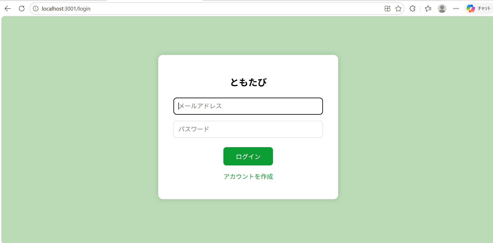
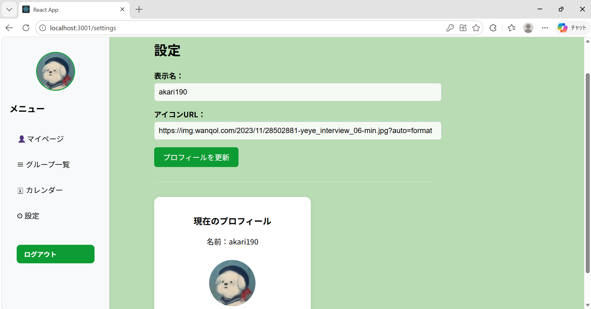
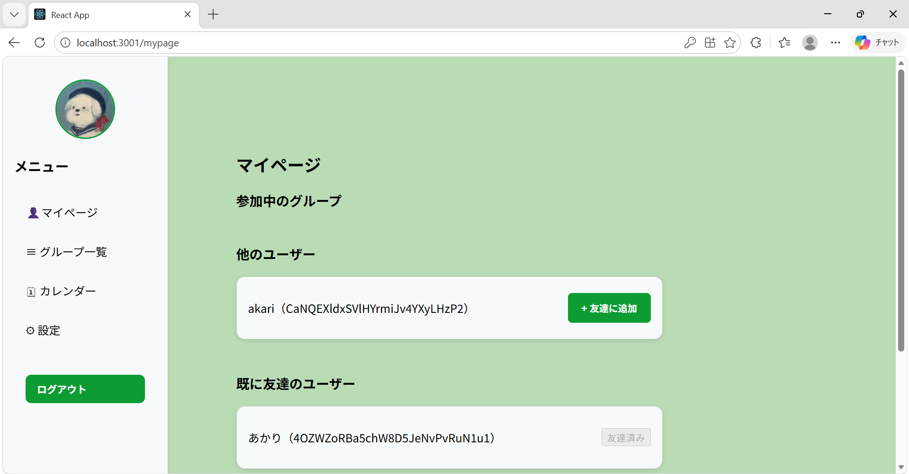
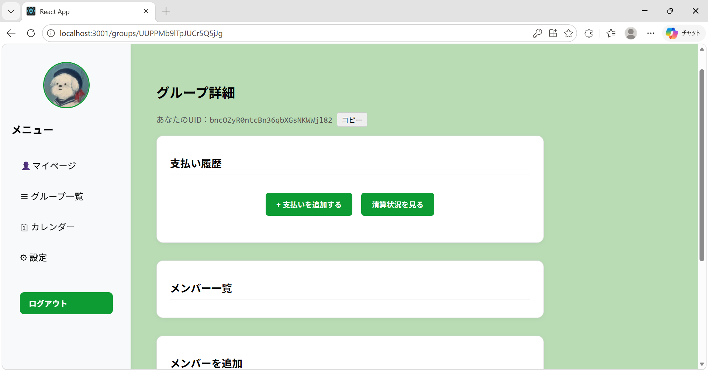
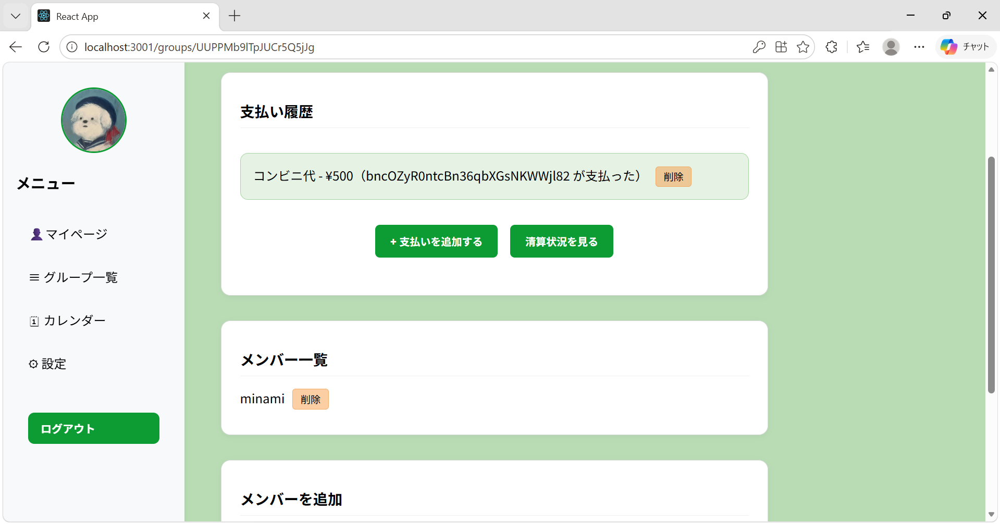
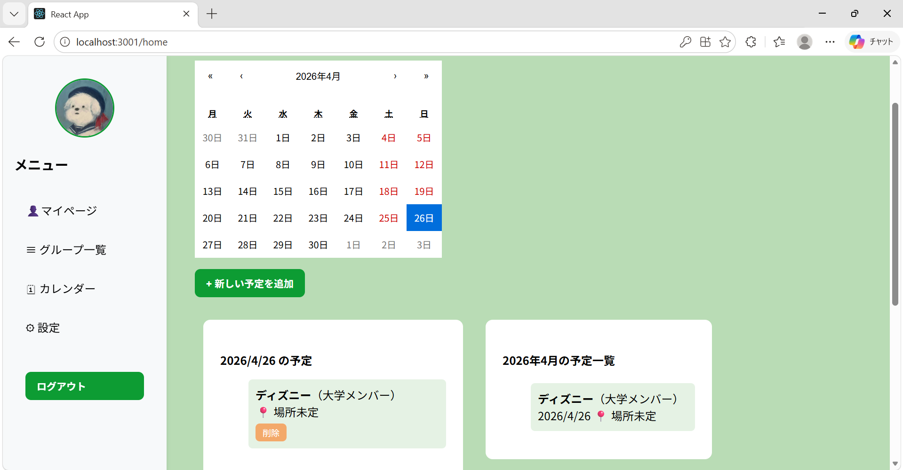

# ともたび

- 旅行メンバーで支払いを管理・精算できるWebアプリ
- 技育ハッカソン vol.9 発表作品 

## 発表資料

[発表資料はこちら](docs/Presentation materials_vol9.pptx)


## アプリ概要
ともたびは、旅行メンバーでグループを作成し、支払いの登録・自動精算により負担額を見える化できるWebアプリです。さらに、自分の参加している予定をカレンダーで一括管理できます。SPAでの作成にこだわり、より簡単に操作ができるようにしました。

## 使用技術
カテゴリ技術フロントエンドReact (JavaScript)バックエンド / DBFirebase (Authentication / Firestore)UICSS / HTML

## 主な機能と画面説明
1.  ログイン・アカウント作成



メールアドレスとパスワードによるユーザー認証をFirebase Authenticationで実装しています。「アカウントを作成」リンクから新規登録も可能です。シンプルなカード型UIで、初めて使うユーザーでも迷わず操作できます。

2.  プロフィール設定



設定画面では表示名とアイコン画像URLを自由に変更できます。プロフィールを更新すると、サイドバーのアイコンにもリアルタイムで反映されます。Firestoreにユーザー情報を保存することで、ログイン後も設定が維持されます。

3. マイページ・フレンド管理



マイページでは参加中のグループの確認に加え、他のユーザーを友達として追加する機能があります。ユーザーIDをもとにFirestore上で友達関係を管理しており、「友達済み」「友達に追加」の状態がリアルタイムで切り替わります。

4. グループ詳細・支払い管理




グループ詳細ページでは以下の操作が可能です。

- 支払いを追加する ― 品目名・金額を入力して支払いを記録。誰が支払ったかがUID付きで履歴表示されます（例：コンビニ代 - ¥500）
- 清算状況を見る ― グループ内の支払い履歴をもとに、誰が誰にいくら払えばよいかを自動計算して表示します
- メンバー一覧 ― グループに参加しているメンバーを確認・削除できます
- メンバーを追加 ― UID入力で新しいメンバーをグループに招待できます
- 自分のUIDはページ上部に表示されており、「コピー」ボタンで簡単に共有できます。

5.  カレンダー・スケジュール管理



カレンダー画面では旅行の予定をグループと紐づけて登録・管理できます。

月単位のカレンダーで日程を視覚的に把握
「＋ 新しい予定を追加」から予定名・場所・グループを設定して登録
選択した日付の予定と、月全体の予定一覧を同時に表示
予定カードに場所・グループ名が表示され、削除も1クリックで可能


### 特徴
- アプリとしての完成度
割り勘機能だけに留まらず、マイページ・設定・カレンダー・グループ管理など、旅行に必要な機能をひとつのアプリに統合しました。
- Firebaseによるリアルタイムなデータ管理
Firebase AuthenticationとFirestoreを組み合わせることで、ユーザー認証・グループ管理・支払い履歴のリアルタイム同期を実現しています。複数ユーザーが同時にグループを操作しても即座に反映されます。
- 親しみやすいUI
左サイドバーによるシームレスなページ遷移、イメージカラーの緑で統一された落ち着いたデザインを採用しました。ボタンの配色やカード型レイアウトにより、直感的に操作できるUIを意識しています。

## 使い方の流れ
1. アカウント作成・ログイン
        ↓
2. 設定画面でニックネーム・アイコンを設定
        ↓
3. グループを作成してメンバーのUIDを追加
        ↓
4. カレンダーに旅行の予定を登録
        ↓
5. 旅行中に支払いを都度記録
        ↓
6. 「清算状況を見る」で精算結果を確認

## デプロイ手順 (Firebase Hostingの場合)

バックエンドにFirebaseを使用しているため、フロントエンドもFirebase Hostingへデプロイするとスムーズです。

1. **Firebase CLIのインストール**
   ```bash
   npm install -g firebase-tools
   ```
2. **Firebaseへログイン**
   ```bash
   firebase login
   ```
3. **Firebaseプロジェクトの初期化**
   ```bash
   firebase init
   ```
   ※ `Hosting: Configure files for Firebase Hosting...` を選択し、公開ディレクトリをご自身の環境に合わせて `build` （Viteなどの場合は `dist`）に設定してください。
4. **プロジェクトのビルド**
   ```bash
   npm run build
   ```
5. **デプロイの実行**
   ```bash
   firebase deploy
   ```
